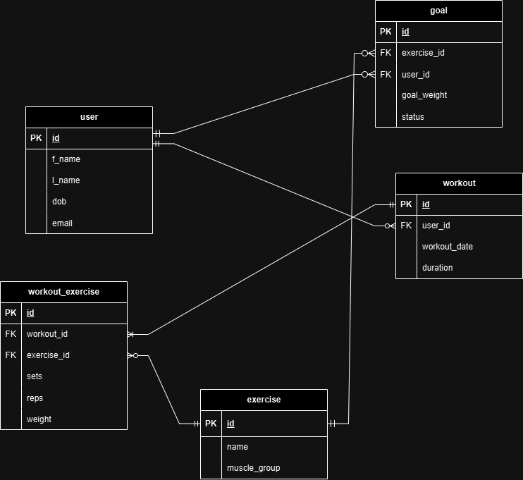

# Fitness Workout Tracker

This is an API to help track users, workouts, goals, and exercises all in one system. Basic operations allow to create, read, update, and delete instances of all the entities.

## Features

## Entity Relational Diagram

## API usage constraints
This API focuses on exercises that utilise machines or free-weights such as dumbells, barbells, olympic bars etc. So for body-weight exercises, cardio exercises and other exercises which do not utilise weight further implementations will be required in the future.