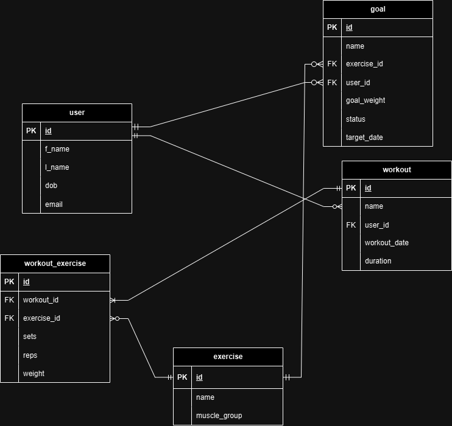

# Fitness Workout Tracker

This is an API to help track users, workouts, goals, and exercises all in one system. Basic operations allow to create, read, update, and delete instances of all the entities.


## Entities

### User
Users can be added, created, deleted, and updated using normal CRUD operations. Users can log their workouts and goals which contain particular exercises of their choosing.

Attributes:
- id: Unique user ID
- f_name: First name of user
- l_name: Last name of user
- dob: Date of birth of user
- email: User's email

### Exercise
Exercises available to be logged in workouts. Normal CRUD operations may also be applied to this entity.

Attributes:
- id: Unique exercise ID.
- name: Name of the exercise.
- muscle_group: Muscle group the exercise targets.

### Workout
The workout a user can log, contains one or more exercises. CRUD operations may be applied to this entity.

Attributes:
- id: Unique workout ID
- name: If the user wishes to name the workout (optional).
- user_id: User ID of user which workout belongs to.
- workout_date: Date of the workout.
- duration: Duration of the workout.

### Workout Exercise
The workout exercises entity is a join table of the workout and exercise tables. Contains the information of one exercise in a workout.

Attributes:
- id: Unique ID of workout exercise.
- workout_id: ID of workout the workout exercise belongs to.
- exercise_id: ID of the exercise.
- sets: Number of sets of exercise performed.
- reps: Number of repititions per set.
- weight: Weight the user perfroms the exercise with.
  
### Goal
A user can set a particular goal for an exercise. Once the goal is achieved it user may manually change the status of the goal once they perform the exercise at the target weight. At this moment a goal is only for one exercise.

Attributes:
- id: Unique ID of goal.
- name: If user wishes to name the goal (optional).
- exercise_id: ID of the exercise.
- user_id: ID of user goal belongs to.
- goal_weight: The target weight for exercise to achieve goal.
- status: If the goal has been achieved or not.

## Entity Relational Diagram


## Installation

### Cloning GitHub repository

To access this API start by cloning the repository to your local device. The repo can be found here --> [Fitness Workout Tracker](https://github.com/earvin-tech/Fitness_API)

1. Create a folder for your project.

2. Open the folder in VS Code or any other code editor

3. Open your terminal and make sure you are in the directory/folder you created. If not enter the following command:
    ```py
    cd [PATH TO FOLDER]
    ```
4. Once you are in the right directory clone the repository:
    ```py
    git clone https://github.com/earvin-tech/Fitness_API
    ```
5. Change directory into the folder cloned:
    ```py
    cd ./Fitness_API
    ```
You should now have access to the files required to run the API.


### Virtual Environment and required packages
It is strongly recommended to use a virtual environment to run this API. Run the following commands in your terminal.

1. **Create Virtual environment**
    ```py
    python3 venv .venv
    ```
2. **Activate virtual environment**
    ```py
    source .venv/bin/activate
    ```
    Every time you open the app you must always activate your virtual environment prior to running the API.

3. **Pip install all required packages**
    ```py
    pip3 install -r requirements.txt
    ```
    All required files are listed in file: 'requirements.txt'. Alternatively you may choose to install the packages individually like so:

    ```py
    pip3 install [PACKAGE NAME]
    ```

## External packages
Below is a list of all required external packages:

- blinker==1.9.0
- click==8.1.7
- Flask==3.1.0
- flask-marshmallow==1.2.1
- Flask-SQLAlchemy==3.1.1
- greenlet==3.1.1
- gunicorn==23.0.0
- itsdangerous==2.2.0
- Jinja2==3.1.4
- MarkupSafe==3.0.2
- marshmallow==3.23.1
- marshmallow-sqlalchemy==1.1.0
- numpy==2.2.0
- optional-django==0.1.0
- packaging==24.2
- pip-licenses==5.0.0
- prettytable==3.12.0
- psycopg2-binary==2.9.10
- python-dotenv==1.0.1
- SQLAlchemy==2.0.36
- tomli==2.2.1
- typing_extensions==4.12.2
- wcwidth==0.2.13
- Werkzeug==3.1.3

## API usage constraints
This API focuses on exercises that utilise machines or free-weights such as dumbells, barbells, olympic bars etc. So for body-weight exercises, cardio exercises and other exercises which do not utilise weight further implementations will be required in the future.