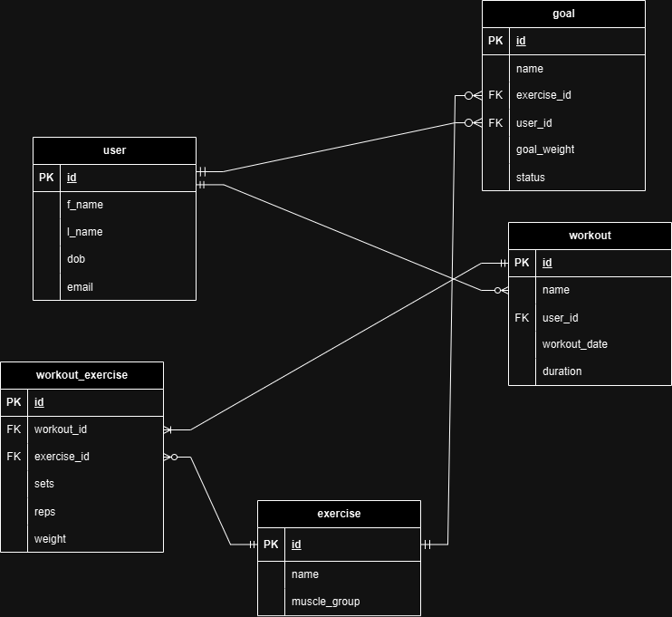

# Fitness Workout Tracker

This is an API to help track users, workouts, goals, and exercises all in one system. Basic operations allow to create, read, update, and delete instances of all the entities.

## Entities

### User
Users can be added, created, deleted, and updated using normal CRUD operations. Users can log their workouts and goals which contain particular exercises of their choosing.

Attributes:
- id: Unique user ID
- f_name: First name of user
- l_name: Last name of user
- dob: Date of birth of user
- email: User's email

### Exercise
Exercises available to be logged in workouts. Normal CRUD operations may also be applied to this entity.

Attributes:
- id: Unique exercise ID.
- name: Name of the exercise.
- muscle_group: Muscle group the exercise targets.

### Workout
The workout a user can log, contains one or more exercises. CRUD operations may be applied to this entity.

Attributes:
- id: Unique workout ID
- name: If the user wishes to name the workout (optional).
- user_id: User ID of user which workout belongs to.
- workout_date: Date of the workout.
- duration: Duration of the workout.

### Workout Exercise
The workout exercises entity is a join table of the workout and exercise tables. Contains the information of one exercise in a workout.

Attributes:
- id: Unique ID of workout exercise.
- workout_id: ID of workout the workout exercise belongs to.
- exercise_id: ID of the exercise.
- sets: Number of sets of exercise performed.
- reps: Number of repititions per set.
- weight: Weight the user perfroms the exercise with.
  
### Goal
A user can set a particular goal for an exercise. Once the goal is achieved it user may manually change the status of the goal once they perform the exercise at the target weight. At this moment a goal is only for one exercise.

Attributes:
- id: Unique ID of goal.
- name: If user wishes to name the goal (optional).
- exercise_id: ID of the exercise.
- user_id: ID of user goal belongs to.
- goal_weight: The target weight for exercise to achieve goal.
- status: If the goal has been achieved or not.

## Entity Relational Diagram

## API usage constraints
This API focuses on exercises that utilise machines or free-weights such as dumbells, barbells, olympic bars etc. So for body-weight exercises, cardio exercises and other exercises which do not utilise weight further implementations will be required in the future.